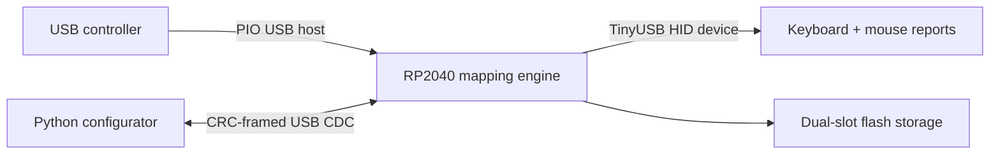

# PicoController2MNK

<p align="center">
  
</p>

An RP2040 firmware and desktop configuration tool that translates supported
USB controller input into configurable USB keyboard and mouse reports.

The project combines embedded C, dual-role USB, a versioned binary protocol,
CRC-protected persistent configuration, and a Python/Tk desktop application.

## Architecture



## Highlights

- Multiple runtime-selectable profiles with direct, tap, hold, double-click,
  combo, turbo, and macro actions.
- Independent keyboard and mouse HID interfaces with a 1 ms USB polling
  interval.
- Configurable stick curves, deadzones, virtual DPI, and guided center/jitter
  calibration.
- Versioned USB CDC protocol with bounds checking and CRC validation.
- Power-loss-tolerant, two-slot flash persistence with schema migration.
- Desktop configuration, macro recording, device discovery, guarded UF2
  validation, and flashing workflows.
- Host-side tests for serialization, protocol framing, device selection,
  firmware invariants, macro timing, and UI logic.

The current firmware parser targets Nintendo Switch Pro-compatible USB HID
reports. The mapping engine and desktop protocol are structured so additional
input report formats can be added separately.

## Quick start

Clone the required USB-host submodule:

```bash
git clone --recurse-submodules https://github.com/Xiaode2333/PicoController2MNK.git
cd PicoController2MNK
```

Build the stable firmware with a configured [Raspberry Pi Pico SDK](https://github.com/raspberrypi/pico-sdk):

```bash
export PICO_SDK_PATH=/path/to/pico-sdk
cmake -S . -B build
cmake --build build --target pico_kbm_mapper -j
```

On Windows with WSL, `build_firmware.bat` runs the same build from the current
checkout and fetches the SDK automatically when necessary. Flash
`build/pico_kbm_mapper.uf2` manually with BOOTSEL, or use the configurator's
guarded firmware workflow.

Install and start the desktop configurator:

```bash
poetry install
poetry run python run_configurator.py
```

Run its tests:

```bash
poetry run python -m unittest discover -s tests -v
```

See [README_CONFIGURATOR.md](README_CONFIGURATOR.md) for device setup,
configuration, persistence, and diagnostics. [MAPPINGS.md](MAPPINGS.md)
documents the shipped example profiles.

## Repository layout

| Path | Purpose |
| --- | --- |
| `main.c`, `mapper_*.c/.h` | USB host/device loop, mapping engine, protocol, and persistent storage |
| `tools/pico2mnk_configurator/` | Desktop application and device protocol client |
| `tests/` | Host-side unit and source-invariant tests |
| `packaging/windows/` | Reproducible PyInstaller and Inno Setup recipes |
| `Pico-PIO-USB` | Pinned upstream USB-host submodule |

Generated firmware, packaged runtimes, and installers are intentionally not
committed. Build them locally from the reviewed source and packaging recipes.

## Hardware and responsible use

USB host wiring and power depend on the chosen RP2040 board. Check the
[Pico-PIO-USB](https://github.com/sekigon-gonnoc/Pico-PIO-USB) documentation
before connecting hardware; this source defaults the PIO USB D+ pin to GPIO 0.

Use macros and remapping only where permitted by the software or platform you
control. Verify mappings on a non-critical system before relying on them.

## License

Project-authored source is available under the [MIT License](LICENSE).
The Pico SDK and Pico-PIO-USB submodule retain their own licenses.
